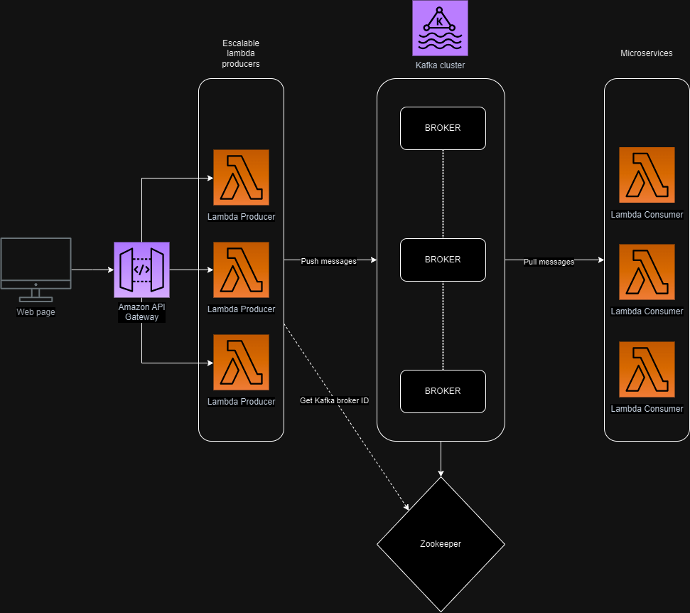

# Arquitectura orientada a eventos

## Concepto

La arquitectura basada en eventos es un modelo de diseño de aplicaciones con la finalidad de emplear servicios desacoplados para registrar, comunicar y procesar eventos.

### Ventajas

* Los elementos de un servicio se encuentran separados de otros servicios, minimizando la dependencia entre estos. Permitiendo a un productor de eventos enviar datos evitando el centrarse en elementos especificos de los servicios. Esto permite flexibilidad, independencia y escalabilidad de los elementos dentro del sistema

* Al estar los elementos del sistema separados, permite una mejor tolerancia a fallos, realizar mantenimientos a los elementos en especificos, responder rapidamente a eventos en tiempo real y uso eficaz de los recursos.

* En organizaciones permite separar los servicios en equipos de desarrollos que se concentran en un objetivo dentro del servicio, en vez de preocuparse por tener una vision global de la arquitectura.

### Desventajas

* El sistema presentara una alta complejidad en comparacion a una arquitectura tradicional, especialmente cuando los eventos e interacciones incrementan.

* La consistencia, coherencia e integridad presentan un desafio, ademas de gestionar los eventos que pueden llegar fuera de secuencia.

* El manejo de logs de los servicios y supervision del flujo de eventos se dificulta por la complejidad y tamaño del sistema.

* Latencia y rendimiento son problemas que se presentan al manejar grandes volumenes de eventos, por lo que requieren de estrategias para procesar los eventos organizadamente y escalar los servicios en base a la demanda de eventos.

* Dependencias en intermediarios de mensajes y buses de eventos pueden introducir errores que afecten a varios servicios si no se manejan apropiadamente.

## Demo de bus de eventos

Se presentara una demo que emplea las tecnologias de zookeeper, como un servicio de coordinacion de codigo abierto, el cual coordinara la plataforma de streaming de eventos kafka, el cual presentara un bus de mensajes mediante un topico, el cual recibira un evento de un productor y este sera consumido del bus por un servidor consumidor.

Esta demo sera desplegada mediante docker.

### Tecnologias empleadas

* Kafka
* Zookeeper
* Servidor en Python
* Docker

### Creditos

* [Demo kafka por aranaea](https://github.com/aranaea/kafka-demo)
* [Eventbridge architecture demo](https://github.com/mavi888/sam-eventbridge)

### Diagrama de la demo aplicada para la aplicacion de Music Fest

Se plantea una arquitectura en la nube en AWS, en la cual mediante un api gateway se pueda acceder a una funcion lambda la cual produce eventos a los diversos topicos dentro del cluster kafka y los consumidores reciben estos eventos y los procesan independientemente. La idea principal es que en la capa previa a la generacion de eventos se realize la logica de interacion y usabilidad de la aplicacion y una vez enviado el evento, la capa de microservicios se dedique a procesar los eventos resultantes.

Un ejemplo de esto seria cuando un cliente compra un ticket siguiendo los pasos a pasos de la aplicacion. Una vez completados los pasos, se procede a enviar el evento de compra de ticket. Este evento en enviado al servicio de compra y al servicio de api de terceros. Estos microservicios generan sus respuestas las cuales se pueden producir el evento de compra completada y se envia el evento al topico relacionado a notificaciones y servicio de correo.

### Video de la demo

[Link para el video](https://youtu.be/woO-zkfgR9s)