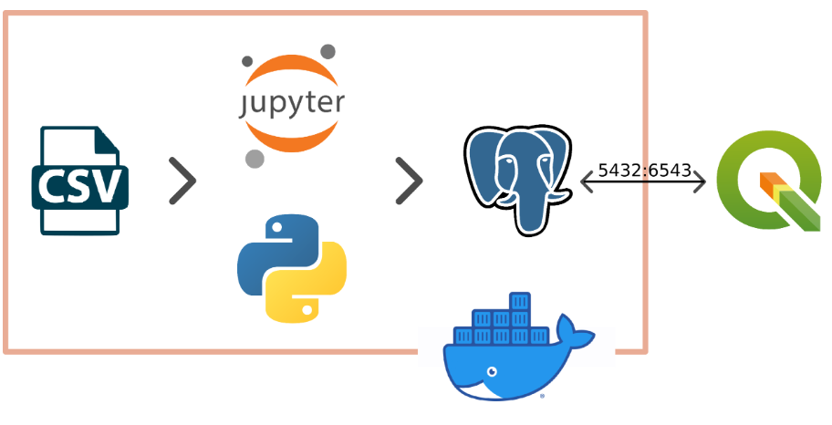

# Manejo de datos geoespaciales

## Concepto

El manejo de datos geo espaciales permite entender y analizar el entorno mediante informacion geografía. Como navegacion GPS o visualizacion geografica. Esta tecnologia nos permite visualizar, intepretar y tomar decisiones informadas.

En este componente individual se presentara una demo en el empleo de tecnologias de manejo de datos geoespaciales.

## Demo de visualizacion de datos geoespaciales

Se presentara en esta demo una visualizacion geografica de pozos en un area de estados unidos mediante la aplicacion QGIS, la cual estara conectada a una base de datos PostgreSQL y una api de google map satelital hibrida. La base de datos PostgreSQL utilizara la extension postgis y estara en el host de un contenedor de docker, el cual emplea jupiter para el manejo de librerias, modificacion de archivos y inicio del servicio postgres.

### Tecnologias empleadas

* Docker
* Python(Jupyter)
* PostgreSQL con extension Postgis
* QGIS Sistema de informacion geografica

### Creditos

* [How to build a Postgis geodabatase with Python and Geoalchemy (with connection to QGIS3) - Tutorial](https://hatarilabs.com/ih-en/how-to-build-a-postgis-geodabatase-with-python-and-geoalchemy-with-connexion-to-qgis3-tutorial)

### Diagrama de la demo

Se plantea utilizar un notebook de jupyter para transformar un archivo CSV de localizaciones de pozos en data geografica de PostGis y visualizar la data mediante la aplicacion QGIS

### Aplicaciones con la aplicacion MusicFest

El manejo de datos geoespaciales permitiria conocer los distritos con mayor cantidad de eventos en lima u otros departamentos. Postgis tiene las herramientas para realizar estas tareas de una forma sensilla y mediante geojson se puede enviar esta informacion en un mapa comprensivo en la aplicacion web.

### Video de la demo

[Video de la demo](https://youtu.be/lQE1xqpVBDM)

### Consideraciones tecnicas de la demo

* Docker (Windows)
    * Instalar [docker desktop](https://docs.docker.com/desktop/install/windows-install/)
    * Inicializar la aplicacion, la cual inicializa el servicio de docker
    * Buscar la [imagen](https://hub.docker.com/r/hatarilabs/hakuchik) en Docker hub
    * Realizar un docker pull de la imagen
* QGIS
    * [Instalar QGIS](https://qgis.org/es/site/forusers/download.html)
    

[Regresar](../Alejandro%20Silva.md)

[Regresar al índice](../../../proyecto.md)