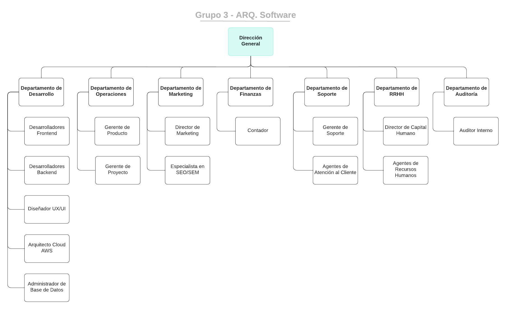

[Regresar al Indice](../proyecto.md)

# Tema del Proyecto

Desarrollar una pagina web para la venta de tickets de conciertos. La pagina permitira a los managers del evento publicar sus conciertos y a los usuarios comprar tickets para los mismos.

# Estructura de Stakeholders

* Gerente de Proyecto (Analista y Evaluador):
    * El gerente de proyecto es esencial para la gestión y coordinación general del proyecto. Este rol se encarga de la planificación, monitoreo y evaluación del progreso del proyecto, asegurando que los requerimientos se cumplan en tiempo y forma. Además, supervisa la implementación de los módulos, garantizando la alineación con los objetivos de negocio y técnicos.

* Arquitecto Cloud AWS (Arquitecto, Conformance Checker, Especialista en Despliegue, Integrador):
    * Este rol es fundamental debido a la decisión de utilizar Amazon Web Services (AWS) para alojar y monitorear el producto. El arquitecto Cloud AWS se encargará de diseñar la infraestructura en la nube, asegurando alta disponibilidad y escalabilidad del sistema mediante el uso de Kubernetes para la orquestación de microservicios. También verifica que la arquitectura cumpla con las normas y regulaciones aplicables (Conformance Checker), despliega las soluciones (Especialista en Despliegue) y facilita la integración de diferentes componentes del sistema (Integrador).

* Gerente de Producto (Gestor de Negocio):
    * El gerente de producto representa la visión del negocio y define la propuesta de valor de la plataforma, enfocándose en la simplicidad, velocidad y seguridad de las transacciones. Este rol asegura que el producto final se alinee con las necesidades del mercado y satisfaga a los usuarios finales, tanto a los event managers como a los compradores de tickets.

* Administrador de Base de Datos (DBA):
    * Dada la elección de MongoDB como motor de base de datos NoSQL para manejar grandes volúmenes de datos de manera flexible, el DBA es crucial para la configuración, administración y optimización de la base de datos, asegurando un rendimiento óptimo y la integridad de los datos.

* Diseñador UX/UI y Especialista SEO/SEM (Diseñador):
    * Este rol es vital para garantizar una experiencia de usuario atractiva y eficiente, alineada con los requerimientos de simplicidad y velocidad en la compra de tickets. El diseñador también se encarga de optimizar la página para motores de búsqueda y campañas publicitarias, contribuyendo a los canales de adquisición de usuarios.

* Desarrolladores Frontend y Backend (Implementador, Mantenedor):
    * Los desarrolladores son responsables de la implementación de los microservicios y la interfaz de usuario utilizando las tecnologías seleccionadas (React para el frontend y frameworks como Express.js o Molecular para el backend). También se encargan del mantenimiento continuo del sistema, realizando actualizaciones y mejoras necesarias.

* Especialista en Seguridad y Desarrolladores Backend (Ingeniero de Pruebas):
    * Este rol es crítico para garantizar la seguridad del sistema, implementando tácticas como autenticación de actores, encriptación de datos y prevención de accesos no autorizados. Los ingenieros de pruebas realizan pruebas exhaustivas para identificar y mitigar vulnerabilidades.

* Dirección General (Cliente):
    * Representa a los interesados finales del proyecto, asegurando que la solución desarrollada cumple con las expectativas estratégicas y operativas de la organización.

* Event Manager y Compradores de Tickets (Usuario):
    * Los event managers son responsables de crear y gestionar eventos en la plataforma, mientras que los usuarios finales compran los tickets. Este grupo proporciona retroalimentación crucial para mejorar la usabilidad y funcionalidad del sistema.

# Organigrama

# Como deberia funcionar
* Los event managers pueden crear eventos para vender tickets, estos eventos pueden ser masivos o pequeños.
    * A partir de eventos medianos, el cliente debe de pagar un monto fijo por alojar la venta de tickets en la aplicacion.
    * Los clientes pueden modificar el precio de los tickets, aplicando un 3% de comision a nosotros.
* Los usuarios pueden comprar uno o varios tickets, indicando por DNI la identidad de la persona.
* El sistema de compra tiene que ser rapido y simple para el usuario
* El sistema de creacion de eventos puede ser lento y debe de priorizar la seguridad de la identidad y recomendaciones para satisfacer las regulaciones del evento (Aforo, permisos, publico objetivo, etc)

# Modelo de negocio
* Segmento de clientes: 
    * Entusiastas de distintos géneros musicales
    * Gerente de conciertos inexperimentados o experimentados
* Canales: 
    * Enlace de Google por busqueda
    * Publicidad de google enfocados a publicar eventos o eventos con promociones
* Propuesta de valor: 
    * Permitir la compra rapida de ticket
    * Crear eventos de música con recomendaciones para asegurar la realización del evento
* Solucion: 
    * Simplicidad
    * Velocidad
    * Seguridad
* Metricas claves: 
    * Carga en la aplicacion (DDOS)
    * Tiempo de espera en cola promedio.
    * Velocidad en la compra de tickets.
* Actividades clave:
    * Creacion de eventos
    * Publicidad de eventos
    * Venta de ticket para los eventos
* Cooperaciones clave
    * Amazon web services para alojar y monitorear el producto
    * Alianzas con los gerentes de eventos en la publicidad de la pagina
* Costos: 
    * Costos de la Nube (servicios AWS)
    * Publicidad de la pagina (Google ads)
    * Comisiones por uso de APIs
    * Costo de equipos y licencias para los desarrolladores
* Ingresos:
    * Comisiones en la creacion de eventos
    * Publicidad de eventos patrocinados
    * Porcentaje en la venta de los tickets

