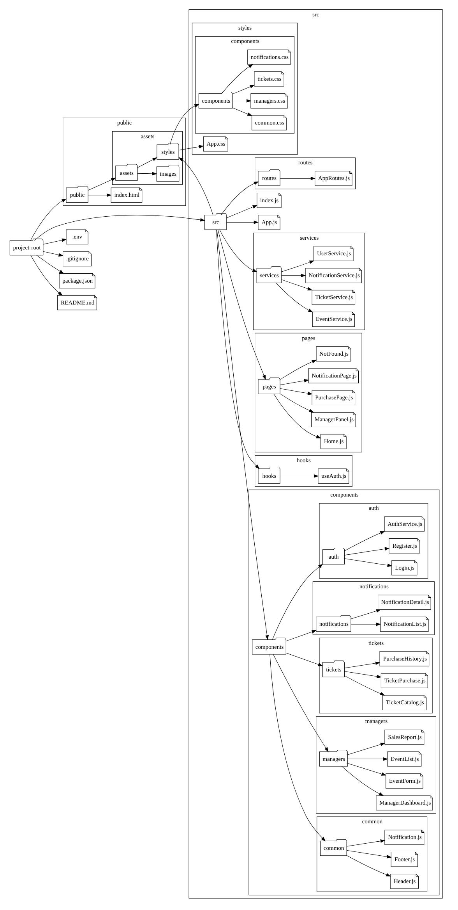

[Regresar al Indice](../proyecto.md)

# Estructura de Carpetas para el proyecto de software

Para implementar el proyecto de software de la venta de tickets de conciertos, se utilizará React.js para el frontend. A continuación, se presenta una estructura inicial de carpetas para la implementación del proyecto de software de venta de tickets de conciertos. En base al framework de React, la estructura fue diseñada para cubrir un flujo básico de registro de información y para proporcionar claridad sobre cómo se implementará cada módulo.

# Descripción de Carpetas y Archivos

## public/

- **index.html**: Archivo HTML principal.
- **assets/**: Carpeta para activos estáticos como imágenes y estilos globales.

## src/

- **components/**: Componentes React divididos por módulos:
  - **common/**: Componentes reutilizables como Header, Footer, y Notification.
  - **managers/**: Componentes relacionados con la gestión de eventos, como ManagerDashboard, EventForm, EventList, y SalesReport.
  - **tickets/**: Componentes relacionados con la compra de tickets, como TicketCatalog, TicketPurchase, y PurchaseHistory.
  - **notifications/**: Componentes para manejar notificaciones, como NotificationList y NotificationDetail.
  - **auth/**: Componentes y servicios de autenticación como Login, Register, y AuthService.
- **hooks/**: Custom hooks de React, como useAuth para manejar la autenticación.
- **pages/**: Páginas principales de la aplicación, como Home, ManagerPanel, PurchasePage, NotificationPage, y NotFound.
- **services/**: Servicios para interactuar con APIs, como EventService, TicketService, NotificationService, y UserService.
- **styles/**: Estilos CSS organizados por componentes y módulos.
- **App.js**: Componente raíz de la aplicación.
- **index.js**: Punto de entrada de la aplicación.
- **routes/**: Configuración de las rutas de la aplicación en AppRoutes.js.

## Archivos Raíz

- **.env**: Archivo de configuración de variables de entorno.
- **.gitignore**: Archivo para ignorar archivos y carpetas en el control de versiones.
- **package.json**: Archivo de configuración de npm para la gestión de dependencias.
- **README.md**: Documentación del proyecto.